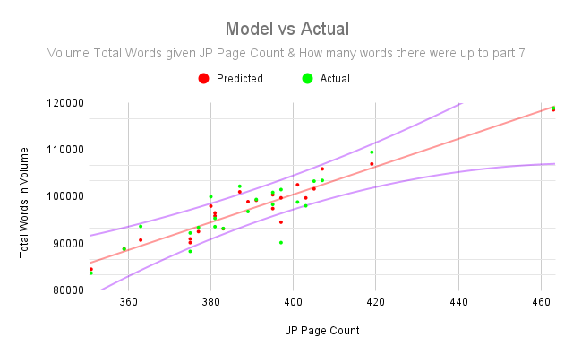

aoab-monitor
============
[](https://github.com/talisein/aoab-monitor/actions/workflows/main.yml)

This is a simple tool that queries the [J-Novel Club](https://j-novel.club) API
and fetches all the lastUpdated fields for Ascendence of a Bookworm epubs.

A github action that runs periodically with my credentials, and makes the data
publicly available on the [gh-pages
branch](https://aoabmonitor.talinet.net/updates.json). There's also a
[human-readable output](https://aoabmonitor.talinet.net/).

To be precise, `https://labs.j-novel.club/app/v1/me/library` is queried, and the
`{book.volume.slug, book.lastUpdated}` pair is collected for Ascendance of a
Bookworm.

A second github action runs weekly to populate [stats](https://aoabmonitor.talinet.net/stats).

The output is something like
```json
{
  "ascendance-of-a-bookworm-royal-academy-stories-first-year": 1658778570,
  "ascendance-of-a-bookworm-part-4-volume-7": 1655401109,
  "ascendance-of-a-bookworm-part-4-volume-6": 1650409432,
  "ascendance-of-a-bookworm-part-4-volume-5": 1644451348,
  "ascendance-of-a-bookworm-part-4-volume-4": 1639525217,
  "ascendance-of-a-bookworm-fanbook-2": 1636593885,
  "ascendance-of-a-bookworm-part-4-volume-3": 1635134465,
  "ascendance-of-a-bookworm-part-4-volume-2": 1631059672,
  "ascendance-of-a-bookworm-part-4-volume-1": 1631059671,
  "ascendance-of-a-bookworm": 1629246812,
  "ascendance-of-a-bookworm-volume-2": 1629240247,
  "ascendance-of-a-bookworm-part-1-volume-3": 1627007792,
  "ascendance-of-a-bookworm-part-3-volume-4": 1625197221,
  "ascendance-of-a-bookworm-fanbook-1": 1625086094,
  "ascendance-of-a-bookworm-part-3-volume-5": 1619745864,
  "ascendance-of-a-bookworm-part-2-volume-2": 1618876341,
  "ascendance-of-a-bookworm-part-2-volume-1": 1618861840,
  "ascendance-of-a-bookworm-part-2-volume-4": 1617340566,
  "ascendance-of-a-bookworm-part-3-volume-3": 1614750018,
  "ascendance-of-a-bookworm-part-3-volume-2": 1606981567,
  "ascendance-of-a-bookworm-part-3-volume-1": 1606981535,
  "ascendance-of-a-bookworm-part-2-volume-3": 1606981458
}
```

Modeling Words Per Volume based on Japanese Page Count
======================================================

At https://aoabmonitor.talinet.net/stats/ the second graph will display a
'projection.' The basis of the projection is based on

    1. Known fact: How many English words have been published so far
    2. Known fact: How many English parts have been released so far
    3. Known fact (usually): How many English parts there will be
    4. Unknown: How many English words the entire volume will have.

To make a guess about how many English words there will be, we can look at how
many pages comprise each Japanese book release. That is one strong variable. A
second variable is how many words have been issued in the current volume. If
week after week the number of words is low, then perhaps the entire volume will
be lower than suggested. What I have done is make 7 models: one model for each
part release. For example, the first week of a new volume has only 1 part. The
math suggests that the influence of how many words are in that first part is a
weaker indicator of the final volume word count compared to how many pages there
were. On the other hand, after 7 weeks the words-so-far variable has more
influence on the final guess.

How accurate is my model?



This graph shows a few things, so lets break it down:

1. The red line shows the average correlation of JP Page Count to English Words.
2. The curved purple lines show roughly how confident you should be in the
   average. P1V3 was 463 pages which is miles more than any other volume, so the
   confidence is lower out there than the cluster around 390 pages.
3. The red dots represent the model's prediction for each volume.
4. The green dots represent the reality, e.g. P5V8 was 397 JP pages had 90231
   English words.

Let's take a moment to consider P2V4 and P5V7. Both of these had 375 JP
Pages. The English word counts were 92279 and 88354 respectively, a difference
of 4000 words.

A 4000 words difference represents about a 4.5% change. That doesn't seem so
large, but:

The average weekly release is about 12000 words. If you are expecting the last
part to be 12000, getting 8000 will feel extrodinarily short. Conversely 16000
would be a huge release.

In conclusion, the model is not good at predicting how big any particular part
will be. But it can give us a broader insight to how the volume is shaping up
overall.
